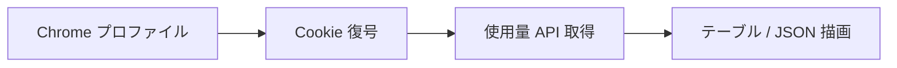

<p align="center">
  
</p>

<h1 align="center">ai-usage</h1>

<p align="center">
  Chrome プロファイル横断で Claude / Codex / Antigravity / PixelLab の使用量を一覧表示する CLI
</p>

<p align="center">
  <a href="https://github.com/owayo/ai-usage/actions/workflows/release.yml">
    
  </a>
  <a href="https://github.com/owayo/ai-usage/actions/workflows/ci.yml">
    
  </a>
  <a href="https://github.com/owayo/ai-usage/releases/latest">
    
  </a>
  <a href="LICENSE">
    
  </a>
</p>

<p align="center">
  <a href="README.md">English</a> |
  <a href="README.ja.md">日本語</a>
</p>

---

サインイン済みの各 Chrome プロファイルについて、**Claude** / **OpenAI Codex (ChatGPT)** / **PixelLab** の使用量
— ローリング **5時間** 枠と **週次** 枠、そしてそれぞれのリセット時刻 — を1コマンドでまとめて表示する
macOS 向け CLI です。PixelLab は月次生成枠を長期(週次)スロットで表示します。

各 Chrome プロファイルのセッションをブラウザから直接読み取るため、ログインし直すことなく
**複数アカウントを同時に**確認できます(例: `Work` と `Home` の2プロファイル × Claude/Codex の
サブスク = 4アカウント)。

```
┌─────────┬──────────┬──────────────────────────┬─────────────────────────────┬─────────────────────────────┐
│ Account ┆ Service  ┆ Plan                     ┆ 5-hour                      ┆ Long window                 │
╞═════════╪══════════╪══════════════════════════╪═════════════════════════════╪═════════════════════════════╡
│ work    ┆ Claude   ┆ max                      ┆ 5h █░░░░░░░░░    4%  · in 2h ┆ 1w █░░░░░░░░░    3%  · in 4d │
│ work    ┆ Codex    ┆ team                     ┆ 5h █░░░░░░░░░    1%  · in 5h ┆ 1w ░░░░░░░░░░    0%  · in 7d │
│ home    ┆ Claude   ┆ max                      ┆ 5h █░░░░░░░░░   12%  · in 1h ┆ 1w █░░░░░░░░░    3%  · in 5d │
│ home    ┆ Codex    ┆ prolite                  ┆ 5h █░░░░░░░░░   10%  · in 4h ┆ 1w ███░░░░░░░   31%  · in 4d │
│ home    ┆ PixelLab ┆ Tier 1: Pixel Apprentice ┆ —                           ┆ 1m █████░░░░░   46%  · in 5d │
└─────────┴──────────┴──────────────────────────┴─────────────────────────────┴─────────────────────────────┘
  updated 21:46 · bars = usage, time = until reset
```

## 特徴

- **マルチアカウント**: サインイン済みの全 Chrome プロファイルを一覧表示。ログインし直し不要
- **マルチプロバイダ**: Claude (`claude.ai`) / Codex (`chatgpt.com`) / Antigravity (Google `agy` CLI・IDE) / PixelLab (`pixellab.ai`) を同一ビューに集約
- **2つの窓**: ローリング 5 時間枠と長期枠(Claude / Codex / Antigravity は 7 日、PixelLab は 1 ヶ月)の利用率とリセット残時間。各行のバッジ (`5h` / `1w` / `1m`) で実サイクルを明示。5 時間枠を持たない行(PixelLab、Antigravity ローカル群)は 2 つのスロットを 1 本の横長バーに統合して空きを回収
- **Cloudflare 対応**: [`wreq`](https://crates.io/crates/wreq) が Chrome の TLS/HTTP2 フィンガープリントをエミュレートし、`cf_clearance` を再送
- **statusline モード**: 端末のステータスバー向けにアカウント 1 行のコンパクト表示。ブランドロゴ字形にも対応
- **JSON 出力**: スクリプト・ダッシュボード向けの機械可読出力
- **設定不要**: サインイン済みプロファイルを自動検出。固定したい場合のみ `~/.config/ai-usage/config.toml`
- **ソート**: 週次利用率、または週次リセット時刻でランキング
- **プライバシー**: ブラウザが Anthropic / OpenAI / Google に対して普段行うのと同じリクエスト以外は外部に出さない

## 動作要件

- **OS**: macOS (Chrome の macOS `v10` Cookie 方式に対応。Windows の `v20` app-bound 方式は未対応)
- **ブラウザ**: Google Chrome (Claude / Codex にサインイン済み)
- **ビルド**: Rust ツールチェイン + **cmake** ([`wreq`](https://crates.io/crates/wreq) の BoringSSL に必要)
- **任意**: Antigravity 使用量には `agy` CLI 起動中、または `~/.gemini` の OAuth トークンが必要

## インストール

### Homebrew (macOS)

```bash
brew install owayo/ai-usage/ai-usage
```

### ソースから

```bash
git clone https://github.com/owayo/ai-usage.git
cd ai-usage
make deps       # 未導入なら cmake を導入
make install    # ビルドして ~/.local/bin へ配置
```

### GitHub Releases から

[Releases](https://github.com/owayo/ai-usage/releases) からお使いのプラットフォーム用のバイナリをダウンロードします。

#### macOS (Apple Silicon)

```bash
curl -L https://github.com/owayo/ai-usage/releases/latest/download/ai-usage-aarch64-apple-darwin.tar.gz | tar xz
sudo mv ai-usage /usr/local/bin/
```

#### macOS (Intel)

```bash
curl -L https://github.com/owayo/ai-usage/releases/latest/download/ai-usage-x86_64-apple-darwin.tar.gz | tar xz
sudo mv ai-usage /usr/local/bin/
```

### cargo から

```bash
brew install cmake
cargo install --path .
```

**初回実行時**は macOS の Keychain ダイアログ(*「"Chrome Safe Storage" キーを使用しようとしています」*)が
出るので **「常に許可」** を選んでください。

## クイックスタート

```bash
# サインイン済み全プロファイル・全プロバイダ
ai-usage

# Claude のみ
ai-usage --only claude

# JSON 出力(スクリプト向け)
ai-usage --json

# 端末ステータスバー向けのコンパクト表示
ai-usage --statusline
```

## 使い方

### コマンド

| コマンド | 説明 |
|---------|------|
| `ai-usage` | サインイン済みの全プロファイル・プロバイダの使用量を表示 |
| `ai-usage --init-config` | 現在サインイン済みのプロファイルから設定ファイルの雛形を生成 |
| `ai-usage --list-profiles` | 検出した Chrome プロファイル一覧を表示 |

### オプション

#### フィルタリング

| オプション | 短縮 | 説明 |
|-----------|------|------|
| `--profile <NAMES>` | `-p` | プロファイル名をカンマ区切りで指定 (Chrome 表示名または on-disk ディレクトリ名) |
| `--only <PROVIDER>` | | `claude` / `codex` / `antigravity` / `pixellab` のみを表示 |

#### 出力

| オプション | 説明 |
|-----------|------|
| `--json` | 機械可読な JSON で出力 |
| `--statusline` | 1 行/アカウントのコンパクト表示 (ステータスバー向け) |
| `--statusline --logos` | ブランドロゴ字形で表示 (BrandLogos フォントが必要) |
| `--statusline --compact` | 狭いペイン向けにゲージ幅を半分にする |
| `--statusline --reset-at` | 週次リセットの絶対時刻 (例: `(06/18 01:10)`) を末尾に併記 |
| `--statusline-hide <PROVIDERS>` | statusline でのみ非表示にする provider (comma 区切り)。`--json` / table には影響なし。例: `--statusline-hide antigravity,codex` |
| `--sort weekly-usage` | 週枠の使用率が高い順 (リミットに近いアカウントを上に) |
| `--sort weekly-reset` | 週枠のリセット時刻が近い順 (リセット待ちが短いアカウントを上に) |

#### アクティブ行の選択

| オプション | 説明 |
|-----------|------|
| `--active-email <EMAIL>` | Claude 行のサインイン済みメールと照合 (既定: `$CLAUDE_CONFIG_DIR/.claude.json`) |
| `--active-profile <NAME>` | プロファイル名で照合 |
| `--active-provider <NAME>` | 1 プロバイダに固定: `claude` / `codex` / `antigravity` |

#### デバッグ・情報

| オプション | 説明 |
|-----------|------|
| `--debug` | 行ごとの判定結果を stderr に JSONL で出力 (stdout はクリーンなまま) |
| `--help` | ヘルプを表示 |
| `--version` | バージョンを表示 |

### 使用例

```bash
# 基本的な使い方
ai-usage                          # 全プロファイル・全プロバイダ
ai-usage -p Work,Home             # プロファイル指定

# プロバイダ絞り込み
ai-usage --only claude
ai-usage --only codex
ai-usage --only antigravity
ai-usage --only pixellab

# 端末ステータスバー向け
ai-usage --statusline
ai-usage --statusline --logos --compact --reset-at

# 優先度でソート
ai-usage --sort weekly-usage      # リミットに近い順
ai-usage --sort weekly-reset      # リセットが近い順
```

## 設定

`ai-usage` は **設定なしでも動作** します。Claude / Codex セッションを持つ Chrome プロファイルを
自動検出して全て表示します。表示対象のプロファイルを固定したい、表示名を変更したい、プロバイダを
絞り込みたい場合は **`~/.config/ai-usage/config.toml`** (または
`$XDG_CONFIG_HOME/ai-usage/config.toml`) を置いてください。

### 初期設定

現在のセッションから雛形を生成できます:

```bash
ai-usage --init-config
```

雛形は [`config.example.toml`](config.example.toml) にもあります。

### 設定例

```toml
# 任意: アクティブとしてハイライトするアカウント
# (既定: CLAUDE_CONFIG_DIR/.claude.json から自動検出 = Claude Code セッションのアカウント)
# active_email = "home@example.com"

# [[profiles]] を1つでも書くと、ここに列挙したものだけが、この順番で表示されます。
[[profiles]]
match = "Work"                    # Chrome の表示名、またはディスク上のディレクトリ名 (例: "Default")
label = "work"                    # 任意: アカウントメール username の代わりに表示
# providers = ["claude", "codex"] # 任意: 表示するサブセット。省略時は両方

[[profiles]]
match = "Home"
label = "home"

# Antigravity (Google `agy`) 使用量。~/.gemini OAuth トークンまたは実行中の
# `agy` があれば自動検出されるため、設定は任意です。ラベル変更、非既定トークンの
# 指定、またはオフにしたい場合だけ追加します。
[antigravity]
# enabled = true                    # false なら検出されても非表示
label = "antigravity"               # 任意: 行に表示するラベル
# token_path = "~/.gemini/antigravity-cli/antigravity-oauth-token"
```

### 設定オプション

| オプション | 説明 | 既定値 |
|-----------|------|--------|
| `active_email` | このアカウントの Claude 行をアクティブとしてハイライト | `CLAUDE_CONFIG_DIR/.claude.json` から自動検出 |
| `[[profiles]]` | 表示するプロファイル一覧 (空なら自動検出) | `[]` (自動) |
| `profiles[].match` | Chrome 表示名または on-disk ディレクトリ名 (例: `Default`) | 必須 |
| `profiles[].label` | アカウントメール username の代わりに表示するラベル | メール username |
| `profiles[].providers` | 表示するプロバイダのサブセット | 両方 |
| `[antigravity].enabled` | 検出時に Antigravity 行を表示 | `true` |
| `[antigravity].label` | Antigravity 行のラベル | `antigravity` |
| `[antigravity].token_path` | 非既定の OAuth トークンパス | `~/.gemini/…` |

優先順位は **CLI フラグ > 設定ファイル > 自動検出** です。

## 動作の仕組み



検出した各 Chrome プロファイルについて:

1. **Cookie 復号**: `~/Library/Application Support/Google/Chrome/<profile>/Cookies` の
   Cookie を、macOS Keychain の **Chrome Safe Storage** キーで復号 (標準の `v10`
   AES‑128‑CBC 方式)。`claude.ai` / `chatgpt.com` 本体に Chrome が送信する Cookie だけを
   再送し、`evilclaude.ai` のような suffix 類似ドメインは無視します。分割された session
   Cookie は suffix が数値 (`.0`, `.1`, ...) の場合だけ受け入れます。
2. **Claude** — `sessionKey` Cookie で `claude.ai/api/organizations/{org}/usage` を呼び
   `five_hour` / `seven_day` の `{utilization, resets_at}` を取得。
3. **Codex** — `__Secure-next-auth.session-token` Cookie を `chatgpt.com/api/auth/session` で
   Bearer トークンに交換し、`chatgpt.com/backend-api/wham/usage` を呼んで
   `rate_limit.primary_window` / `secondary_window` を取得。
4. **Antigravity** — `~/.gemini` の OAuth トークンを読み (必要に応じて refresh)、`agy`
   起動中は localhost の quota サーバー (グループ別の詳細ペイロード) を優先。停止時は
   Google の `cloudcode-pa.googleapis.com/v1internal:retrieveUserQuota` にフォールバック。
   表示用の最も制約が厳しい bucket は、nested / flat 両方の `remainingFraction` 形を読んで選びます。
5. **PixelLab** — `www.pixellab.ai` の `supabase-auth-token` Cookie から access/refresh
   token を取り出し、期限切れなら `supabase.pixellab.ai/auth/v1/token` で更新した上で
   `api.pixellab.ai/get-account-data` (月次生成枠 `imageGenerated / imageAmount` と
   プリペイド `credits`) と `api.pixellab.ai/get-subscription` (プラン名 +
   `generation_reset_date`) を取得。月次枠はレイアウト共通化のため長期スロットに
   表示し、行内バッジを `1w` ではなく `1m` にして週次と誤読しないようにする。5 時間枠が
   ない provider は 5h スロットを畳んで長期スロットを横長バー(通常の 2 スロット分の
   横幅)に拡張する。

`claude.ai` と `chatgpt.com` はいずれも Cloudflare の背後にあるため、HTTP クライアント
([`wreq`](https://crates.io/crates/wreq)) が Chrome の TLS/HTTP2 フィンガープリントを
エミュレートし、プロファイルの `cf_clearance` Cookie を再送します (素の HTTP クライアントは
`403` になります)。

ブラウザが Anthropic / OpenAI / Google に対して普段行うのと同じ認証付きリクエスト以外、
データは外部に出ません。トークンや Cookie を出力・保存することもありません。

## ビルドコマンド

| コマンド | 説明 |
|---------|------|
| `make build` | デバッグビルド |
| `make release` | 最適化リリースビルド (strip + LTO) |
| `make install` | ビルドして `~/.local/bin` にインストール |
| `make uninstall` | インストール済みバイナリを削除 |
| `make test` | テスト実行 |
| `make fmt` | コードフォーマット |
| `make check` | clippy (`-D warnings`) + rustfmt チェック + cargo check |
| `make clean` | ビルド成果物をクリーン |
| `make deps` | ビルド前提 (cmake) を導入 |

## 注意・制限

- **macOS + Google Chrome 専用** (Chrome は macOS で `v10` Cookie 方式を使用。
  Windows の `v20` app-bound 方式には未対応)
- `cf_clearance` Cookie が失効していると、その 1 アカウントだけ *Cloudflare challenge* エラーになります。
  該当サイトをその Chrome プロファイルで一度開いて更新し、再実行してください (他アカウントには影響しません)
- 使用量エンドポイントは **非公式 / リバースエンジニアリング** によるもので、変更される可能性があります
- 依存の `wreq-util` が **GPL‑3.0** のため、本プロジェクトも GPL‑3.0 ライセンスです

## 謝辞

**Antigravity** (Google の `agy` CLI / IDE) の使用量対応は、
[CodexBar](https://github.com/steipete/CodexBar) の Antigravity プロバイダ実装
([実装メモ](https://github.com/steipete/CodexBar/blob/main/docs/antigravity.md)) を
参考にしています。

## コントリビュート

コントリビュートを歓迎します！お気軽にプルリクエストをお送りください。

## 変更履歴

バージョン履歴は [Releases](https://github.com/owayo/ai-usage/releases) を参照してください。

## ライセンス

[GPL-3.0](LICENSE)
