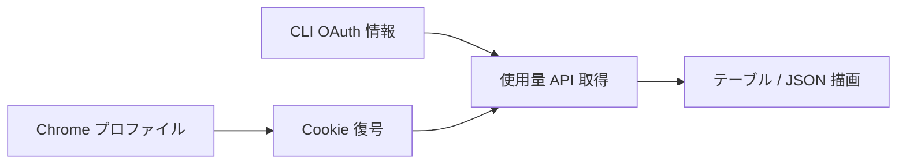

<p align="center">
  
</p>

<h1 align="center">ai-usage</h1>

<p align="center">
  サインイン済みの全 Chrome プロファイルと CLI の OAuth アカウントについて、Claude / Codex / Antigravity / PixelLab / Grok の使用量をまとめて表示する macOS 向け CLI
</p>

<!-- standard:badges:start -->
<h3 align="center">対応プラットフォーム</h3>

<p align="center">
  
</p>

<p align="center">
  <a href="https://github.com/owayo/ai-usage/actions/workflows/ci.yml"></a>
  <a href="https://github.com/owayo/ai-usage/releases/latest"></a>
  <a href="LICENSE"></a>
</p>

<p align="center">
  <a href="README.md">English</a> |
  <a href="README.ja.md">日本語</a>
</p>
<!-- standard:badges:end -->

---

**Claude** / **OpenAI Codex (ChatGPT)** / **Antigravity** / **PixelLab** / **Grok** の使用量を1コマンドでまとめて表示する macOS 向け CLI です。ブラウザ認証のアカウントはサインイン済みの Chrome プロファイルを横断し、Antigravity と Grok は CLI の OAuth 情報から取得します。

各 Chrome プロファイルのセッションをブラウザから直接読み取るため、ログインし直すことなく **複数アカウントを同時に**確認できます(例: `Work` と `Home` の2プロファイル × Claude/Codex のサブスク = 4アカウント)。

## 機能

- **マルチアカウント**: サインイン済みの全 Chrome プロファイルを一覧表示。ログインし直し不要。表示名はプロバイダのメール、Chrome プロファイルのメール、プロファイル名の順に解決し、空値や `@` の欠落・重複を含む不正なメールは読み飛ばす
- **マルチプロバイダ**: Claude (`claude.ai`) / Codex (`chatgpt.com`) / Antigravity (Google `agy` CLI・IDE) / PixelLab (`pixellab.ai`) / Grok (xAI `grok` CLI) を同一ビューに集約
- **型付き利用枠**: 各 quota が 5 時間・日次・週次・月次の実周期を保持し、利用率とリセット残時間を表示。行内バッジ (`5h` / `1d` / `1w` / `1m`) は quota 自身の周期から決定。利用枠が1つだけの行は 2 つのスロットを 1 本の横長バーに統合。周期情報がない旧キャッシュでも、プロバイダーに応じたラベルとリセット警告色を維持
- **Cloudflare 対応**: [`wreq`](https://crates.io/crates/wreq) が Chrome の TLS/HTTP2 フィンガープリントをエミュレートし、`cf_clearance` を再送
- **statusline モード**: 端末のステータスバー向けにアカウント 1 行のコンパクト表示。ブランドロゴ字形にも対応
- **JSON 出力**: スクリプト・ダッシュボード向けの機械可読出力
- **設定不要**: サインイン済みプロファイルを自動検出。固定したい場合のみ `~/.config/ai-usage/config.toml`
- **ソート**: 長期枠の利用率、またはリセット時刻でランキング (`weekly-*` のオプション名は互換性のため維持)
- **プライバシー**: 対応プロバイダへの認証付き使用量リクエスト以外は外部に出さない

## 動作環境

- **ブラウザ**: ブラウザ認証プロバイダ用の Google Chrome (Claude / Codex / PixelLab にサインイン済み)。下記の OAuth 認証プロバイダのみを使う場合は Chrome は不要 — 見つからない場合はその旨を stderr に出し、残りのプロバイダを表示する
- **ソースからのビルド**: 下記の Cargo とソースからの導入には CMake が必要 ([`wreq`](https://crates.io/crates/wreq) の BoringSSL のビルドが呼び出す)。`brew install cmake` で導入できる (未導入なら `make setup` が導入する)
- **任意**: Antigravity 使用量には Antigravity.app、`agy` CLI、または `~/.gemini` の OAuth トークンが必要
- **任意**: Grok 使用量には `grok` CLI にサインイン済み (`~/.grok/auth.json`) が必要

## インストール

<!-- standard:install:start -->
### Homebrew (macOS)

```bash
brew install owayo/ai-usage/ai-usage
```

### Cargo

Rust 1.98 以上が必要です。

```bash
cargo install --git https://github.com/owayo/ai-usage --locked
```

### GitHub Releases から

[Releases](https://github.com/owayo/ai-usage/releases/latest) から自分の環境のアーカイブを取得して展開し、`ai-usage` を `PATH` の通った場所に置きます。各リリースには、取得したファイルを確かめるための `SHA256SUMS` も添付しています。

| プラットフォーム | ファイル |
|---|---|
| macOS (Intel) | `ai-usage-x86_64-apple-darwin.tar.gz` |
| macOS (Apple Silicon) | `ai-usage-aarch64-apple-darwin.tar.gz` |

macOS でブラウザから取得した場合は、実行の前に隔離属性を外します: `xattr -d com.apple.quarantine ai-usage`。

### ソースから

[mise](https://mise.jdx.dev/) が必要です (Rust のツールチェーンは `mise.toml` で固定しています)。

```bash
git clone https://github.com/owayo/ai-usage.git
cd ai-usage
make install
```

`make install` は `/usr/local/bin` に入れます。場所を変えるときは `INSTALL_PATH` を指定します (例: `make install INSTALL_PATH="$HOME/.local/bin"`)。
<!-- standard:install:end -->

### 初回の実行

ブラウザ認証のプロバイダから初めて使用量を取得するときは、macOS の Keychain ダイアログ (*「"Chrome Safe Storage" キーを使用しようとしています」*) が出ます。**「常に許可」** を選んでください。

## 使い方

引数なしで `ai-usage` を実行すると、サインイン済みの全アカウントを表示します。

```text
┌─────────┬──────────┬──────────────────────────┬─────────────────────────────┬─────────────────────────────┐
│ Account ┆ Service  ┆ Plan                     ┆ Short window                ┆ Long window                 │
╞═════════╪══════════╪══════════════════════════╪═════════════════════════════╪═════════════════════════════╡
│ work    ┆ Claude   ┆ max                      ┆ 5h █░░░░░░░░░    4%  · in 2h ┆ 1w █░░░░░░░░░    3%  · in 4d │
│ work    ┆ Codex    ┆ team                     ┆ 5h █░░░░░░░░░    1%  · in 5h ┆ 1w ░░░░░░░░░░    0%  · in 7d │
│ home    ┆ Claude   ┆ max                      ┆ 5h █░░░░░░░░░   12%  · in 1h ┆ 1w █░░░░░░░░░    3%  · in 5d │
│ home    ┆ Codex    ┆ prolite                  ┆ 5h █░░░░░░░░░   10%  · in 4h ┆ 1w ███░░░░░░░   31%  · in 4d │
│ home    ┆ PixelLab ┆ Tier 1: Pixel Apprentice ┆ —                           ┆ 1m █████░░░░░   46%  · in 5d │
└─────────┴──────────┴──────────────────────────┴─────────────────────────────┴─────────────────────────────┘
  updated 21:46 · bars = usage, time = until reset
```

```bash
# 基本的な使い方
ai-usage                          # 全プロファイル・全プロバイダ
ai-usage -p Work,Home             # プロファイル指定
ai-usage --list-profiles          # 検出した Chrome プロファイルの一覧

# プロバイダ絞り込み
ai-usage --only claude
ai-usage --only codex
ai-usage --only antigravity
ai-usage --only pixellab
ai-usage --only grok

# JSON 出力 (スクリプト向け)
ai-usage --json

# 端末ステータスバー向け
ai-usage --statusline
ai-usage --statusline --logos --compact --reset-at

# 優先度でソート
ai-usage --sort weekly-usage      # リミットに近い順
ai-usage --sort weekly-reset      # リセットが近い順
```

全コマンドと全オプションは [docs/cli-reference.ja.md](docs/cli-reference.ja.md) にまとめています。アクティブ行の選択、キャッシュ済みの `--json` ファイルからステータスバーを速く描き直す `--input`、`--debug` もそちらにあります。

## 設定

`ai-usage` は **設定なしでも動作** します。Claude / Codex / PixelLab セッションを持つ Chrome プロファイルに加え、利用可能な Antigravity / Grok の OAuth 情報も自動検出します。表示対象のプロファイルを固定したい、表示名を変更したい、プロバイダを絞り込みたい場合は **`~/.config/ai-usage/config.toml`** (または `$XDG_CONFIG_HOME/ai-usage/config.toml`) を置いてください。`--config <PATH>` を付けると、代わりにそのファイルを読みます。

現在のセッションから雛形を生成できます (雛形は [`config.example.toml`](config.example.toml) にもあります)。

```bash
ai-usage --init-config
```

2 つのプロファイルを短いラベルで表示する最小の設定です。

```toml
# [[profiles]] を1つでも書くと、ここに列挙したものだけが、この順番で表示されます。
[[profiles]]
match = "Work"                    # Chrome の表示名、またはディスク上のディレクトリ名 (例: "Default")
label = "work"                    # 任意: アカウントメール username の代わりに表示

[[profiles]]
match = "Home"
label = "home"
```

優先順位は **CLI フラグ > 設定ファイル > 自動検出** です。Antigravity・Grok・statusline の各テーブルと、全項目の既定値は [docs/configuration.ja.md](docs/configuration.ja.md) にあります。

## 動作の仕組み


```mermaid
flowchart LR
    A[Chrome プロファイル] --> B[Cookie 復号]
    C[CLI OAuth 情報] --> D[使用量 API 取得]
    B --> D
    D --> E[テーブル / JSON 描画]
```

ブラウザ認証のプロファイルでは、macOS Keychain の **Chrome Safe Storage** キーで Chrome の Cookie を復号し、各プロバイダの使用量エンドポイントを呼びます。Antigravity と Grok は CLI の OAuth 情報を使います。`claude.ai` と `chatgpt.com` は Cloudflare の背後にあるため、HTTP クライアント ([`wreq`](https://crates.io/crates/wreq)) が Chrome の TLS/HTTP2 フィンガープリントをエミュレートし、プロファイルの `cf_clearance` Cookie を再送します。

Anthropic / OpenAI / Google / PixelLab / xAI への認証付き使用量リクエスト以外、データは外部に出ません。トークンや Cookie を出力・保存することもありません。

プロバイダごとのエンドポイント、Cookie の扱い、再試行の方針は [docs/architecture.ja.md](docs/architecture.ja.md) にあります。

## 注意・制限

- **macOS + Google Chrome 専用** (Chrome は macOS で `v10` Cookie 方式を使用。Windows の `v20` app-bound 方式には未対応)
- OAuth 系プロバイダには Chrome は不要です。Chrome が未インストール、`Local State` を読めない、Keychain のダイアログを拒否した、いずれの場合も、通常実行では stderr に `skipping Chrome profiles: …` を出したうえで Antigravity / Grok は描画を続けます。Chrome そのものが目的の `--list-profiles` / `--init-config` だけがエラーになります。取得対象が Chrome だけのときは Keychain のエラーをそのまま報告するので、ダイアログを承認して再実行すべきことが分かります
- 設定ファイルが読めない場合は自動検出にフォールバックします。既定パスに設定が無いケースは無言ですが、`--config` で明示指定したパスが読めないときは stderr に報告します (パスのタイプミスが「設定が無視されている」ように見えるのを防ぐため)
- `cf_clearance` Cookie が失効していると、その 1 アカウントだけ *Cloudflare challenge* エラーになります。該当サイトをその Chrome プロファイルで一度開いて更新し、再実行してください (他アカウントには影響しません)
- Antigravity のモデルグループ別の週次クォータはローカルの `language_server` からしか取得できないため、両グループを表示するには Antigravity.app または `agy` が起動している必要があります。`~/.gemini` の OAuth トークンだけの場合、Google が `retrieveUserQuota` を `403` で拒否し、その行は *OAuth token lacks quota permission — open `agy` for full data* と表示されます
- 使用量エンドポイントは **非公式 / リバースエンジニアリング** によるもので、変更される可能性があります

## 謝辞

**Antigravity** (Google の `agy` CLI / IDE) の使用量対応は、[CodexBar](https://github.com/steipete/CodexBar) の Antigravity プロバイダ実装 ([実装メモ](https://github.com/steipete/CodexBar/blob/main/docs/antigravity.md)) を参考にしています。

## 開発

<!-- standard:dev:start -->
[mise](https://mise.jdx.dev/) が必要です。ツールの版は `mise.toml` で固定しています。

```bash
make setup   # ツールチェーン (mise) と依存を取得する
make ci      # CI と同じ検査 (書き換えない)
```

| コマンド | 説明 |
|---|---|
| `make setup` | ツールチェーン (mise) と依存を取得する |
| `make build` | デバッグ版をビルドする |
| `make release` | リリース版をビルドする |
| `make run` | デバッグ版を実行する (引数は ARGS="...") |
| `make test` | テストを実行する |
| `make lint` | clippy を警告ゼロで通す |
| `make fmt` | コードを整形する (書き換える) |
| `make fmt-check` | 整形済みかを確かめる (書き換えない) |
| `make check` | 整形と静的検査 (書き換えない) |
| `make ci` | CI と同じ検査 (書き換えない) |
| `make install` | リリース版を INSTALL_PATH (既定 /usr/local/bin) に入れる |
| `make uninstall` | INSTALL_PATH から取り除く |
| `make clean` | ビルド成果物を消す |

`make` でターゲットの一覧を表示します。リリースは GitHub Actions で行います (**Actions → Release → Run workflow**)。
<!-- standard:dev:end -->

ビルドには CMake も必要です ([動作環境](#動作環境) を参照)。`make setup` が `make deps` を呼び、未導入なら Homebrew で導入します。

## ライセンス

<!-- standard:license:start -->
[MIT](LICENSE)
<!-- standard:license:end -->
