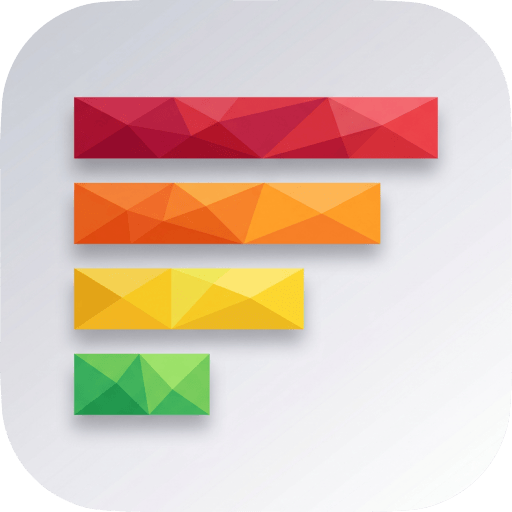
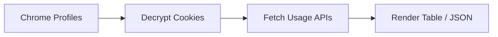

<p align="center">
  
</p>

<h1 align="center">ai-usage</h1>

<p align="center">
  Unified Claude + Codex + Antigravity + PixelLab usage limits across Chrome profiles
</p>

<p align="center">
  <a href="https://github.com/owayo/ai-usage/actions/workflows/release.yml">
    
  </a>
  <a href="https://github.com/owayo/ai-usage/actions/workflows/ci.yml">
    
  </a>
  <a href="https://github.com/owayo/ai-usage/releases/latest">
    
  </a>
  <a href="LICENSE">
    
  </a>
</p>

<p align="center">
  <a href="README.md">English</a> |
  <a href="README.ja.md">日本語</a>
</p>

---

One command to see your **Claude** and **OpenAI Codex (ChatGPT)** usage limits — the
rolling **5-hour** window and the **weekly** window, plus when each resets —
across every Chrome profile you're signed into.

It reads each Chrome profile's session straight from the browser, so it can report
**multiple accounts at once** (e.g. a `Work` and an `Home` profile, each with both a
Claude and a Codex subscription = four accounts) without you logging anything in or out.

```
┌─────────┬──────────┬──────────────────────────┬─────────────────────────────┬─────────────────────────────┐
│ Account ┆ Service  ┆ Plan                     ┆ 5-hour                      ┆ Long window                 │
╞═════════╪══════════╪══════════════════════════╪═════════════════════════════╪═════════════════════════════╡
│ work    ┆ Claude   ┆ max                      ┆ 5h █░░░░░░░░░    4%  · in 2h ┆ 1w █░░░░░░░░░    3%  · in 4d │
│ work    ┆ Codex    ┆ team                     ┆ 5h █░░░░░░░░░    1%  · in 5h ┆ 1w ░░░░░░░░░░    0%  · in 7d │
│ home    ┆ Claude   ┆ max                      ┆ 5h █░░░░░░░░░   12%  · in 1h ┆ 1w █░░░░░░░░░    3%  · in 5d │
│ home    ┆ Codex    ┆ prolite                  ┆ 5h █░░░░░░░░░   10%  · in 4h ┆ 1w ███░░░░░░░   31%  · in 4d │
│ home    ┆ PixelLab ┆ Tier 1: Pixel Apprentice ┆ —                           ┆ 1m █████░░░░░   46%  · in 5d │
└─────────┴──────────┴──────────────────────────┴─────────────────────────────┴─────────────────────────────┘
  updated 21:46 · bars = usage, time = until reset
```

## Features

- **Multi-Account**: Reports every Chrome profile signed into Claude, Codex, or PixelLab — no re-login needed
- **Multi-Provider**: Claude (`claude.ai`), Codex (`chatgpt.com`), Antigravity (Google's `agy` CLI/IDE), and PixelLab (`pixellab.ai`) in one view
- **Two Windows**: Rolling 5-hour and a long window (weekly for Claude / Codex / Antigravity, monthly for PixelLab) with usage bar, percentage, and reset countdown — each row's badge (`5h` / `1w` / `1m`) shows the exact cycle. Rows without a 5-hour window (PixelLab, Antigravity local-server groups) collapse both slots into a single wider bar so no space is wasted on empty `5h`
- **Cloudflare-Safe**: Emulates Chrome's TLS/HTTP2 fingerprint via [`wreq`](https://crates.io/crates/wreq) and replays `cf_clearance` cookies
- **Statusline Mode**: Compact one-line-per-account output with brand logos for terminal status bars
- **JSON Output**: Machine-readable output for scripting and dashboards
- **Zero Config**: Auto-discovers all signed-in profiles by default; optional `~/.config/ai-usage/config.toml` for pinning
- **Sort Options**: Rank rows by weekly utilization or reset time
- **Privacy**: Nothing leaves your machine except the same requests your browser already makes to Anthropic/OpenAI/Google

## Requirements

- **OS**: macOS (Chrome uses macOS `v10` cookie encryption; Windows `v20` app-bound scheme is not handled)
- **Browser**: Google Chrome (signed into Claude and/or Codex)
- **Build**: Rust toolchain + **cmake** (required by [`wreq`](https://crates.io/crates/wreq)'s BoringSSL)
- **Optional**: `agy` CLI or `~/.gemini` OAuth token for Antigravity usage

## Installation

### Homebrew (macOS)

```bash
brew install owayo/ai-usage/ai-usage
```

### From Source

```bash
git clone https://github.com/owayo/ai-usage.git
cd ai-usage
make deps       # install cmake if missing
make install    # build + install to ~/.local/bin
```

### From GitHub Releases

Download the latest binary from [Releases](https://github.com/owayo/ai-usage/releases).

#### macOS (Apple Silicon)

```bash
curl -L https://github.com/owayo/ai-usage/releases/latest/download/ai-usage-aarch64-apple-darwin.tar.gz | tar xz
sudo mv ai-usage /usr/local/bin/
```

#### macOS (Intel)

```bash
curl -L https://github.com/owayo/ai-usage/releases/latest/download/ai-usage-x86_64-apple-darwin.tar.gz | tar xz
sudo mv ai-usage /usr/local/bin/
```

### With cargo

```bash
brew install cmake
cargo install --path .
```

The **first run** triggers a macOS Keychain prompt
(*"… wants to use the 'Chrome Safe Storage' key"*) — choose **Always Allow**.

## Quickstart

```bash
# All signed-in profiles, all providers
ai-usage

# Only Claude across all profiles
ai-usage --only claude

# JSON output for scripts
ai-usage --json

# Compact statusline for your terminal status bar
ai-usage --statusline
```

## Usage

### Commands

| Command | Description |
|---------|-------------|
| `ai-usage` | Show usage for all signed-in profiles and providers |
| `ai-usage --init-config` | Generate a starter config from currently signed-in sessions |
| `ai-usage --list-profiles` | List discovered Chrome profiles |

### Options

#### Filtering

| Option | Short | Description |
|--------|-------|-------------|
| `--profile <NAMES>` | `-p` | Comma-separated profile names (Chrome display name or on-disk dir) |
| `--only <PROVIDER>` | | Show only `claude`, `codex`, `antigravity`, or `pixellab` |

#### Output

| Option | Description |
|--------|-------------|
| `--json` | Machine-readable JSON output |
| `--statusline` | Compact one-line-per-account output for status bars |
| `--statusline --logos` | With brand-logo glyphs (requires the BrandLogos font) |
| `--statusline --compact` | Half-width gauge for narrow panes |
| `--statusline --reset-at` | Append the weekly reset clock-time, e.g. `(06/18 01:10)` |
| `--sort weekly-usage` | Rank rows by weekly utilization (closest to the cap first) |
| `--sort weekly-reset` | Rank rows by weekly reset time (soonest first) |

#### Active row selection

| Option | Description |
|--------|-------------|
| `--active-email <EMAIL>` | Match the signed-in email of a Claude row (default: `$CLAUDE_CONFIG_DIR/.claude.json`) |
| `--active-profile <NAME>` | Match a profile by name |
| `--active-provider <NAME>` | Pin to a single provider: `claude`, `codex`, or `antigravity` |

#### Debug & Info

| Option | Description |
|--------|-------------|
| `--debug` | Print per-row match decisions to stderr as JSONL (stdout stays clean for pipes) |
| `--help` | Print help |
| `--version` | Print version |

### Examples

```bash
# Basic usage
ai-usage                          # all profiles, all providers
ai-usage -p Work,Home             # specific profiles only

# Filter provider
ai-usage --only claude
ai-usage --only codex
ai-usage --only antigravity
ai-usage --only pixellab

# Statusline for terminal status bar
ai-usage --statusline
ai-usage --statusline --logos --compact --reset-at

# Sort by urgency
ai-usage --sort weekly-usage      # closest to the cap first
ai-usage --sort weekly-reset      # soonest reset first
```

## Configuration

`ai-usage` needs **no configuration** — it auto-discovers every Chrome profile that has a
Claude or Codex session and shows them all. To pin *which* profiles appear, rename them, or
limit providers, drop a file at **`~/.config/ai-usage/config.toml`**
(or `$XDG_CONFIG_HOME/ai-usage/config.toml`).

### Initial Setup

Generate a starter config from your current sessions:

```bash
ai-usage --init-config
```

A template also lives at [`config.example.toml`](config.example.toml).

### Example Configuration

```toml
# Optional: highlight this account as active (default: auto-detected from
# CLAUDE_CONFIG_DIR/.claude.json — the Claude Code session's account).
# active_email = "home@example.com"

# Listing any [[profiles]] shows ONLY those, in this order.
[[profiles]]
match = "Work"                    # Chrome display name, or on-disk dir e.g. "Default"
label = "work"                    # optional: shown instead of the account email username
# providers = ["claude", "codex"] # optional: subset to show; default = both

[[profiles]]
match = "Home"
label = "home"

# Antigravity (Google's `agy`). Auto-discovered when ~/.gemini token or a running
# `agy` is found — config is optional. Use it only to relabel, pin a non-default
# token, or disable the row.
[antigravity]
# enabled = true                    # false to hide even when detected
label = "antigravity"               # optional row label
# token_path = "~/.gemini/antigravity-cli/antigravity-oauth-token"
```

### Configuration Options

| Option | Description | Default |
|--------|-------------|---------|
| `active_email` | Highlight this account's Claude row as active | Auto-detected from `CLAUDE_CONFIG_DIR/.claude.json` |
| `[[profiles]]` | Explicit list of profiles to show (empty = auto-discover all) | `[]` (auto) |
| `profiles[].match` | Chrome display name or on-disk directory (e.g. `Default`) | Required |
| `profiles[].label` | Display label instead of the account email username | Email username |
| `profiles[].providers` | Subset of providers to show for this profile | Both |
| `[antigravity].enabled` | Show the Antigravity row when detected | `true` |
| `[antigravity].label` | Row label for Antigravity | `antigravity` |
| `[antigravity].token_path` | Non-default OAuth token path | `~/.gemini/…` |

Precedence: **CLI flags > config file > auto-detection**.

## How It Works



For each Chrome profile it finds, `ai-usage`:

1. **Decrypts** cookies from `~/Library/Application Support/Google/Chrome/<profile>/Cookies`
   using the **Chrome Safe Storage** key from your macOS Keychain (standard `v10`
   AES‑128‑CBC scheme). Only cookies Chrome would send to `claude.ai` / `chatgpt.com`
   themselves are replayed — suffix lookalikes like `evilclaude.ai` are filtered out.
2. **Claude** — uses the `sessionKey` cookie to call
   `claude.ai/api/organizations/{org}/usage` → `five_hour` / `seven_day` `{utilization, resets_at}`.
3. **Codex** — uses the `__Secure-next-auth.session-token` cookie to exchange for a Bearer
   token via `chatgpt.com/api/auth/session`, then calls `chatgpt.com/backend-api/wham/usage`
   → `rate_limit.primary_window` / `secondary_window`.
4. **Antigravity** — reads the OAuth token from `~/.gemini` (refreshing as needed). When
   `agy` is running, prefers the localhost quota server for the richer per-group payload;
   otherwise falls back to Google's `cloudcode-pa.googleapis.com/v1internal:retrieveUserQuota`.
5. **PixelLab** — reads the `supabase-auth-token` cookie from `www.pixellab.ai`, refreshing
   the access token via `supabase.pixellab.ai/auth/v1/token` if it has expired, then calls
   `api.pixellab.ai/get-account-data` (monthly `imageGenerated / imageAmount` + prepaid
   `credits`) and `api.pixellab.ai/get-subscription` (plan name + `generation_reset_date`).
   The monthly quota renders in the long-window column with a `1m` badge (rather than the
   usual `1w`) so it isn't mistaken for a weekly reset. Since PixelLab has no rolling
   5-hour window, the 5-hour slot is collapsed and the long-window slot expands into a
   wider bar spanning the same total width as the two-slot layout.

`claude.ai` and `chatgpt.com` sit behind Cloudflare, so the HTTP client
([`wreq`](https://crates.io/crates/wreq)) emulates Chrome's TLS/HTTP2 fingerprint and
replays the profile's `cf_clearance` cookie — a plain HTTP client just gets a `403`.

Nothing leaves your machine except the same authenticated requests your browser already
makes to Anthropic, OpenAI, and Google. No tokens or cookies are printed or stored.

## Build Commands

| Command | Description |
|---------|-------------|
| `make build` | Debug build |
| `make release` | Optimized release build (strip + LTO) |
| `make install` | Build and install to `~/.local/bin` |
| `make uninstall` | Remove the installed binary |
| `make test` | Run tests |
| `make fmt` | Format code |
| `make check` | clippy (`-D warnings`) + rustfmt check + cargo check |
| `make clean` | Clean build artifacts |
| `make deps` | Install build prerequisites (cmake) |

## Notes & Limitations

- **macOS + Google Chrome only**. Chrome uses `v10` cookie encryption on macOS; Windows'
  `v20` app-bound scheme is not handled.
- If a `cf_clearance` cookie has gone stale you'll see a *Cloudflare challenge* error for
  that one account — open the relevant site once in that Chrome profile to refresh it, then
  re-run. Other accounts are unaffected.
- The usage endpoints are **undocumented / reverse-engineered** and may change.
- This tool depends on `wreq-util`, which is **GPL‑3.0**; this project is therefore licensed
  GPL‑3.0.

## Acknowledgements

**Antigravity** (Google's `agy` CLI / IDE) usage support follows the
reverse-engineering in [CodexBar](https://github.com/steipete/CodexBar)'s
Antigravity provider — see its
[implementation notes](https://github.com/steipete/CodexBar/blob/main/docs/antigravity.md).

## Contributing

Contributions are welcome! Please feel free to submit a Pull Request.

## Changelog

See [Releases](https://github.com/owayo/ai-usage/releases) for version history.

## License

[GPL-3.0](LICENSE)
