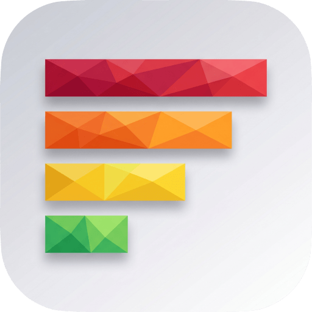
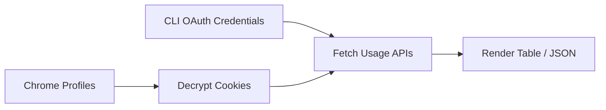

<p align="center">
  
</p>

<h1 align="center">ai-usage</h1>

<p align="center">
  macOS CLI that shows Claude, Codex, Antigravity, PixelLab, and Grok usage limits across all Chrome profiles and CLI OAuth accounts
</p>

<!-- standard:badges:start -->
<h3 align="center">Supported Platforms</h3>

<p align="center">
  
</p>

<p align="center">
  <a href="https://github.com/owayo/ai-usage/actions/workflows/ci.yml"></a>
  <a href="https://github.com/owayo/ai-usage/releases/latest"></a>
  <a href="LICENSE"></a>
</p>

<p align="center">
  <a href="README.md">English</a> |
  <a href="README.ja.md">日本語</a>
</p>
<!-- standard:badges:end -->

---

One command to see usage limits for **Claude**, **OpenAI Codex (ChatGPT)**, **Antigravity**, **PixelLab**, and **Grok**. Browser-backed accounts are collected across every signed-in Chrome profile, while Antigravity and Grok use their CLI OAuth credentials.

It reads each Chrome profile's session straight from the browser, so it can report **multiple accounts at once** (e.g. a `Work` and a `Home` profile, each with both a Claude and a Codex subscription = four accounts) without you logging anything in or out.

## Features

- **Multi-Account**: Reports every Chrome profile signed into Claude, Codex, or PixelLab — no re-login needed. Account labels fall back from the provider email to the Chrome profile email and then the profile name, skipping empty or malformed email values (including missing or duplicate `@` separators)
- **Multi-Provider**: Claude (`claude.ai`), Codex (`chatgpt.com`), Antigravity (Google's `agy` CLI/IDE), PixelLab (`pixellab.ai`), and Grok (xAI's `grok` CLI) in one view
- **Typed Windows**: Each quota carries its real cycle (5-hour, daily, weekly, or monthly) with a usage bar, percentage, and reset countdown — each row's badge (`5h` / `1d` / `1w` / `1m`) comes from the quota itself. Any row with only one window collapses both slots into a single wider bar. Older caches without cycle metadata retain provider-appropriate labels and reset-warning thresholds
- **Cloudflare-Safe**: Emulates Chrome's TLS/HTTP2 fingerprint via [`wreq`](https://crates.io/crates/wreq) and replays `cf_clearance` cookies
- **Statusline Mode**: Compact one-line-per-account output with brand logos for terminal status bars
- **JSON Output**: Machine-readable output for scripting and dashboards
- **Zero Config**: Auto-discovers all signed-in profiles by default; optional `~/.config/ai-usage/config.toml` for pinning
- **Sort Options**: Rank rows by long-window utilization or reset time (`weekly-*` option names are retained for compatibility)
- **Privacy**: Nothing leaves your machine except authenticated usage requests to the providers listed above

## Requirements

- **Browser**: Google Chrome (signed into Claude, Codex, and/or PixelLab) for browser-backed providers. Chrome is optional if you only use the OAuth-backed providers below — when it is missing, `ai-usage` notes it on stderr and reports the remaining providers
- **Build from source**: The Cargo and From Source methods below need CMake, which the BoringSSL build inside [`wreq`](https://crates.io/crates/wreq) calls. Install it with `brew install cmake` (`make setup` installs it when it is missing)
- **Optional**: Antigravity app, `agy` CLI, or `~/.gemini` OAuth token for Antigravity usage
- **Optional**: `grok` CLI signed in (`~/.grok/auth.json`) for Grok usage

## Installation

<!-- standard:install:start -->
### Homebrew (macOS)

```bash
brew install owayo/ai-usage/ai-usage
```

### Cargo

Requires Rust 1.98 or later.

```bash
cargo install --git https://github.com/owayo/ai-usage --locked
```

### From GitHub Releases

Download the archive for your platform from [Releases](https://github.com/owayo/ai-usage/releases/latest), extract it, and put `ai-usage` on your `PATH`. Each release also includes `SHA256SUMS` for checking the downloads.

| Platform | Archive |
|---|---|
| macOS (Intel) | `ai-usage-x86_64-apple-darwin.tar.gz` |
| macOS (Apple Silicon) | `ai-usage-aarch64-apple-darwin.tar.gz` |

On macOS, if you downloaded the archive with a browser, remove the quarantine attribute before running it: `xattr -d com.apple.quarantine ai-usage`.

### From Source

Requires [mise](https://mise.jdx.dev/) (the Rust toolchain is pinned in `mise.toml`).

```bash
git clone https://github.com/owayo/ai-usage.git
cd ai-usage
make install
```

`make install` installs to `/usr/local/bin`. Set `INSTALL_PATH` to change it (for example `make install INSTALL_PATH="$HOME/.local/bin"`).
<!-- standard:install:end -->

### First run

The first run with a browser-backed provider triggers a macOS Keychain prompt (*"… wants to use the 'Chrome Safe Storage' key"*). Choose **Always Allow**.

## Usage

Run `ai-usage` with no arguments to see every signed-in account:

```text
┌─────────┬──────────┬──────────────────────────┬─────────────────────────────┬─────────────────────────────┐
│ Account ┆ Service  ┆ Plan                     ┆ Short window                ┆ Long window                 │
╞═════════╪══════════╪══════════════════════════╪═════════════════════════════╪═════════════════════════════╡
│ work    ┆ Claude   ┆ max                      ┆ 5h █░░░░░░░░░    4%  · in 2h ┆ 1w █░░░░░░░░░    3%  · in 4d │
│ work    ┆ Codex    ┆ team                     ┆ 5h █░░░░░░░░░    1%  · in 5h ┆ 1w ░░░░░░░░░░    0%  · in 7d │
│ home    ┆ Claude   ┆ max                      ┆ 5h █░░░░░░░░░   12%  · in 1h ┆ 1w █░░░░░░░░░    3%  · in 5d │
│ home    ┆ Codex    ┆ prolite                  ┆ 5h █░░░░░░░░░   10%  · in 4h ┆ 1w ███░░░░░░░   31%  · in 4d │
│ home    ┆ PixelLab ┆ Tier 1: Pixel Apprentice ┆ —                           ┆ 1m █████░░░░░   46%  · in 5d │
└─────────┴──────────┴──────────────────────────┴─────────────────────────────┴─────────────────────────────┘
  updated 21:46 · bars = usage, time = until reset
```

```bash
# Basic usage
ai-usage                          # all profiles, all providers
ai-usage -p Work,Home             # specific profiles only
ai-usage --list-profiles          # list the Chrome profiles it found

# Filter provider
ai-usage --only claude
ai-usage --only codex
ai-usage --only antigravity
ai-usage --only pixellab
ai-usage --only grok

# JSON output for scripts
ai-usage --json

# Statusline for terminal status bar
ai-usage --statusline
ai-usage --statusline --logos --compact --reset-at

# Sort by urgency
ai-usage --sort weekly-usage      # closest to the cap first
ai-usage --sort weekly-reset      # soonest reset first
```

Every command and option, including active-row selection, `--input` for fast status-bar redraws from a cached `--json` file, and `--debug`: [docs/cli-reference.md](docs/cli-reference.md)

## Configuration

`ai-usage` needs **no configuration**: it auto-discovers every Chrome profile that has a Claude, Codex, or PixelLab session, plus available Antigravity and Grok OAuth credentials. To pin *which* profiles appear, rename them, or limit providers, put a file at **`~/.config/ai-usage/config.toml`** (or `$XDG_CONFIG_HOME/ai-usage/config.toml`). `--config <PATH>` reads another file instead.

Generate a starter config from your current sessions (a template also lives at [`config.example.toml`](config.example.toml)):

```bash
ai-usage --init-config
```

A minimal config that shows two profiles under short labels:

```toml
# Listing any [[profiles]] shows ONLY those, in this order.
[[profiles]]
match = "Work"                    # Chrome display name, or on-disk dir e.g. "Default"
label = "work"                    # optional: shown instead of the account email username

[[profiles]]
match = "Home"
label = "home"
```

Precedence: **CLI flags > config file > auto-detection**. The Antigravity, Grok, and statusline tables and every key with its default: [docs/configuration.md](docs/configuration.md)

## How It Works


```mermaid
flowchart LR
    A[Chrome Profiles] --> B[Decrypt Cookies]
    C[CLI OAuth Credentials] --> D[Fetch Usage APIs]
    B --> D
    D --> E[Render Table / JSON]
```

For browser-backed profiles, `ai-usage` decrypts Chrome's cookies with the **Chrome Safe Storage** key from your macOS Keychain and calls each provider's usage endpoint. Antigravity and Grok use their CLI OAuth credentials instead. `claude.ai` and `chatgpt.com` sit behind Cloudflare, so the HTTP client ([`wreq`](https://crates.io/crates/wreq)) emulates Chrome's TLS/HTTP2 fingerprint and replays the profile's `cf_clearance` cookie.

Nothing leaves your machine except authenticated usage requests to Anthropic, OpenAI, Google, PixelLab, and xAI. No tokens or cookies are printed or stored.

Per-provider endpoints, cookie handling, and the retry policy: [docs/architecture.md](docs/architecture.md)

## Notes & Limitations

- **macOS + Google Chrome only**. Chrome uses `v10` cookie encryption on macOS; Windows' `v20` app-bound scheme is not handled.
- Chrome is optional for the OAuth-only providers. When Chrome isn't installed, its `Local State` can't be read, or you decline the Keychain prompt, a normal run prints `skipping Chrome profiles: …` on stderr and still renders Antigravity and Grok. Only `--list-profiles` / `--init-config` fail outright, since Chrome is the whole point of those modes — and when Chrome is the *only* target, the Keychain error is reported verbatim so you know to approve the prompt and re-run.
- An unreadable config falls back to auto-discovery. A missing *default* config is silent, but a `--config` path you passed explicitly is reported on stderr, so a typo doesn't masquerade as "my config is being ignored".
- If a `cf_clearance` cookie has gone stale you'll see a *Cloudflare challenge* error for that one account — open the relevant site once in that Chrome profile to refresh it, then re-run. Other accounts are unaffected.
- Antigravity's grouped weekly quota is served only by the local `language_server`, so Antigravity.app or `agy` has to be running to see both model groups. With just the `~/.gemini` OAuth token, Google may reject `retrieveUserQuota` with a `403`, and the row reads *OAuth token lacks quota permission — open `agy` for full data*.
- The usage endpoints are **undocumented / reverse-engineered** and may change.

## Acknowledgements

**Antigravity** (Google's `agy` CLI / IDE) usage support follows the reverse-engineering in [CodexBar](https://github.com/steipete/CodexBar)'s Antigravity provider — see its [implementation notes](https://github.com/steipete/CodexBar/blob/main/docs/antigravity.md).

## Development

<!-- standard:dev:start -->
Requires [mise](https://mise.jdx.dev/). Tool versions are pinned in `mise.toml`.

```bash
make setup   # Install the toolchain (mise) and dependencies
make ci      # Run the same checks as CI (no changes)
```

| Command | Description |
|---|---|
| `make setup` | Install the toolchain (mise) and dependencies |
| `make build` | Build a debug binary |
| `make release` | Build a release binary |
| `make run` | Run the debug binary (arguments via ARGS="...") |
| `make test` | Run the tests |
| `make lint` | Run clippy with warnings as errors |
| `make fmt` | Format the code (rewrites files) |
| `make fmt-check` | Check the formatting (no changes) |
| `make check` | Run fmt-check and lint (no changes) |
| `make ci` | Run the same checks as CI (no changes) |
| `make install` | Install the release binary to INSTALL_PATH (default /usr/local/bin) |
| `make uninstall` | Remove the binary from INSTALL_PATH |
| `make clean` | Remove build artifacts |

Run `make` to list every target. Releases are published from GitHub Actions (**Actions → Release → Run workflow**).
<!-- standard:dev:end -->

Building also needs CMake (see [Requirements](#requirements)). `make setup` runs `make deps`, which installs it with Homebrew when it is missing.

## License

<!-- standard:license:start -->
[MIT](LICENSE)
<!-- standard:license:end -->
