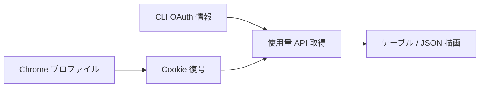

# 動作の仕組み

ブラウザ認証プロファイルと CLI OAuth プロバイダについて:

1. **Cookie 復号**: `~/Library/Application Support/Google/Chrome/<profile>/Cookies` の
   Cookie を、macOS Keychain の **Chrome Safe Storage** キーで復号 (標準の `v10`
   AES‑128‑CBC 方式)。稼働中の SQLite DB は読み取り専用で開くため、未チェックポイントの
   WAL にある最新 Cookie も取得できます。`claude.ai` / `chatgpt.com` 本体に Chrome が送信する Cookie だけを
   再送し、`evilclaude.ai` のような suffix 類似ドメインは無視します。分割された session
   Cookie は suffix が数値 (`.0`, `.1`, ...) の場合だけ受け入れます。
2. **Claude** — `sessionKey` Cookie で `claude.ai/api/organizations/{org}/usage` を呼び
   `five_hour` / `seven_day` の `{utilization, resets_at}` を取得。
3. **Codex** — `__Secure-next-auth.session-token` Cookie を `chatgpt.com/api/auth/session` で
   Bearer トークンに交換し、`chatgpt.com/backend-api/wham/usage` を呼んで
   `rate_limit.primary_window` / `secondary_window` を取得。
4. **Antigravity** — `~/.gemini` の OAuth トークンを読み (必要に応じて refresh)、
   Antigravity.app または `agy` の起動中は localhost の quota サーバー (グループ別の詳細
   ペイロード)を優先します。app/IDE はプロセス引数の `--csrf_token` で認証し、`agy` は
   token 不要のローカル endpoint を使います。どちらも利用できない場合は Google の
   `cloudcode-pa.googleapis.com/v1internal:retrieveUserQuota` にフォールバックします。
   表示用の最も制約が厳しい bucket は、nested / flat 両方の `remainingFraction` 形を読んで選び、
   数値がない bucket は除外します。
   ローカル quota は実周期に応じて `1w` / `5h`、OAuth fallback の日次 quota は `1d` と表示します。
5. **PixelLab** — `www.pixellab.ai` の `supabase-auth-token` Cookie を、従来の URL
   エンコード済み JSON 配列形式と Supabase の `base64-` + padding なし Base64URL
   オブジェクト形式の両方から読み、access/refresh token を取り出します。期限切れなら
   `supabase.pixellab.ai/auth/v1/token` で更新した上で
   `api.pixellab.ai/get-account-data` (月次生成枠 `imageGenerated / imageAmount` と
   プリペイド `credits`) と `api.pixellab.ai/get-subscription` (プラン名 +
   `generation_reset_date`) を取得。月次枠はレイアウト共通化のため長期スロットに
   表示し、行内バッジを `1w` ではなく `1m` にして週次と誤読しないようにする。5 時間枠が
   ない provider は 5h スロットを畳んで長期スロットを横長バー(通常の 2 スロット分の
   横幅)に拡張する。
6. **Grok** — `~/.grok/auth.json` (`grok login` が書き出す) の OAuth 情報を読み、
   複数の認証 entry がある場合は必要項目の揃った最新 entry を選び、不完全な entry は
   無視する。期限が近ければ `auth.x.ai/oauth2/token`
   (`refresh_token` grant、public OAuth
   client なので secret 不要) で更新した上で
   `cli-chat-proxy.grok.com/v1/user?include=subscription` でプラン (`subscriptionTier`
   → null は `Free`) を、`cli-chat-proxy.grok.com/v1/billing` で月次サイクル
   (`used / monthlyLimit`、`billingPeriodEnd` をリセット時刻) を取得する。
   PixelLab と同じく短期枠がないため単一の `1m` 横長バーとして表示し、
   `monthlyLimit == 0` の Free では 0% のまま billing period 末尾までの残り時間だけを
   表示する。

## Cloudflare と再試行

`claude.ai` と `chatgpt.com` はいずれも Cloudflare の背後にあるため、HTTP クライアント ([`wreq`](https://crates.io/crates/wreq)) が Chrome の TLS/HTTP2 フィンガープリントをエミュレートし、プロファイルの `cf_clearance` Cookie を再送します (素の HTTP クライアントは `403` になります)。通信エラーと HTTP `408` / `429` / `5xx` は GET / POST とも同じ再試行ポリシーで処理し、各プロバイダのジョブは再試行を含めて 20 秒以内に打ち切ります。ただしトークンの refresh を送信したあとの失敗は再試行しません。ai-usage はローテーション後の refresh token を書き戻さないため、フェッチをやり直すとサーバ側で既にローテーション済みのトークンを再送してしまうためです。

## プライバシー

Anthropic / OpenAI / Google / PixelLab / xAI への認証付き使用量リクエスト以外、データは外部に出ません。トークンや Cookie を出力・保存することもありません。
