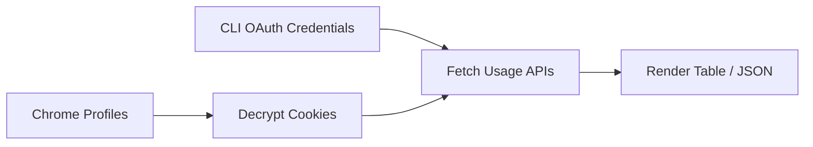

# How it works

For browser-backed profiles and CLI OAuth providers, `ai-usage`:

1. **Decrypts** cookies from `~/Library/Application Support/Google/Chrome/<profile>/Cookies`
   using the **Chrome Safe Storage** key from your macOS Keychain (standard `v10`
   AES‑128‑CBC scheme). The live SQLite database is opened read-only so current,
   uncheckpointed WAL entries remain visible. Only cookies Chrome would send to `claude.ai` / `chatgpt.com`
   themselves are replayed — suffix lookalikes like `evilclaude.ai` are filtered out.
   Chunked session cookies are accepted only when their suffix is numeric (`.0`, `.1`, ...).
2. **Claude** — uses the `sessionKey` cookie to call
   `claude.ai/api/organizations/{org}/usage` → `five_hour` / `seven_day` `{utilization, resets_at}`.
3. **Codex** — uses the `__Secure-next-auth.session-token` cookie to exchange for a Bearer
   token via `chatgpt.com/api/auth/session`, then calls `chatgpt.com/backend-api/wham/usage`
   → `rate_limit.primary_window` / `secondary_window`.
4. **Antigravity** — reads the OAuth token from `~/.gemini` (refreshing as needed). When
   Antigravity.app or `agy` is running, it prefers the localhost quota server for the richer
   per-group payload. App/IDE processes are authenticated with the `--csrf_token` value from
   their process arguments; `agy` exposes a tokenless local endpoint. If neither local path is
   usable, it falls back to Google's `cloudcode-pa.googleapis.com/v1internal:retrieveUserQuota`.
   Both nested and flat `remainingFraction` quota shapes are handled when choosing the most
   constrained bucket for display; buckets without a numeric value are skipped. Local grouped
   quotas are labeled `1w` / `5h` from their
   actual window, while the OAuth fallback's daily quota is labeled `1d`.
5. **PixelLab** — reads the `supabase-auth-token` cookie from `www.pixellab.ai` in either
   the legacy URL-encoded JSON-array form or Supabase's `base64-` + unpadded Base64URL
   object form, refreshing
   the access token via `supabase.pixellab.ai/auth/v1/token` if it has expired, then calls
   `api.pixellab.ai/get-account-data` (monthly `imageGenerated / imageAmount` + prepaid
   `credits`) and `api.pixellab.ai/get-subscription` (plan name + `generation_reset_date`).
   The monthly quota renders in the long-window column with a `1m` badge (rather than the
   usual `1w`) so it isn't mistaken for a weekly reset. Since PixelLab has no rolling
   5-hour window, the 5-hour slot is collapsed and the long-window slot expands into a
   wider bar spanning the same total width as the two-slot layout.
6. **Grok** — reads OAuth credentials from `~/.grok/auth.json` (written by `grok login`),
   choosing the newest complete credential when the file contains multiple entries and
   ignoring incomplete entries, then refreshing the access token
   via `auth.x.ai/oauth2/token` (`refresh_token` grant, public
   OAuth client — no secret) when it is about to expire. Calls
   `cli-chat-proxy.grok.com/v1/user?include=subscription` for the plan (`subscriptionTier`
   → falls back to `Free`) and `cli-chat-proxy.grok.com/v1/billing` for the monthly cycle
   (`used / monthlyLimit`, plus `billingPeriodEnd` as the reset time). Like PixelLab this
   renders as a single wide `1m` bar; when `monthlyLimit == 0` (Free) the bar stays at 0%
   but keeps the reset countdown so you still see when the billing period turns over.

## Cloudflare and retries

`claude.ai` and `chatgpt.com` sit behind Cloudflare, so the HTTP client ([`wreq`](https://crates.io/crates/wreq)) emulates Chrome's TLS/HTTP2 fingerprint and replays the profile's `cf_clearance` cookie — a plain HTTP client just gets a `403`. Transport failures and HTTP `408` / `429` / `5xx` responses use the same bounded retry policy for GET and POST requests, with a 20-second deadline per provider job. Once a token refresh has been sent for a provider, its remaining failures are *not* retried: ai-usage never writes a rotated refresh token back, so replaying that fetch would resend a token the server may already have rotated away.

## Privacy

Nothing leaves your machine except authenticated usage requests to Anthropic, OpenAI, Google, PixelLab, and xAI. No tokens or cookies are printed or stored.
